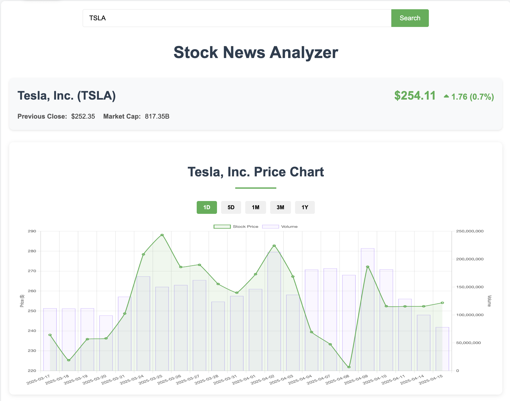
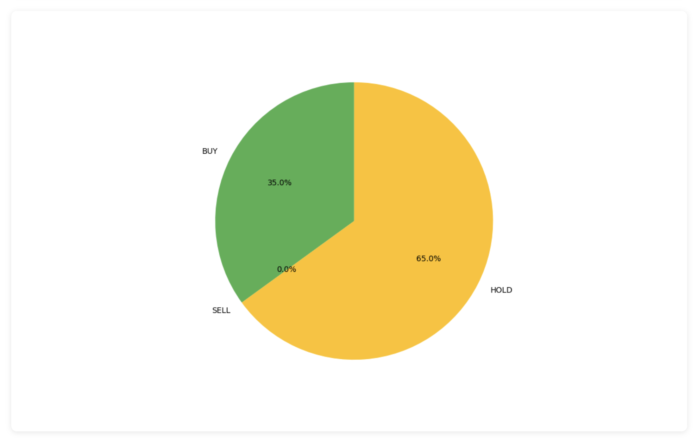
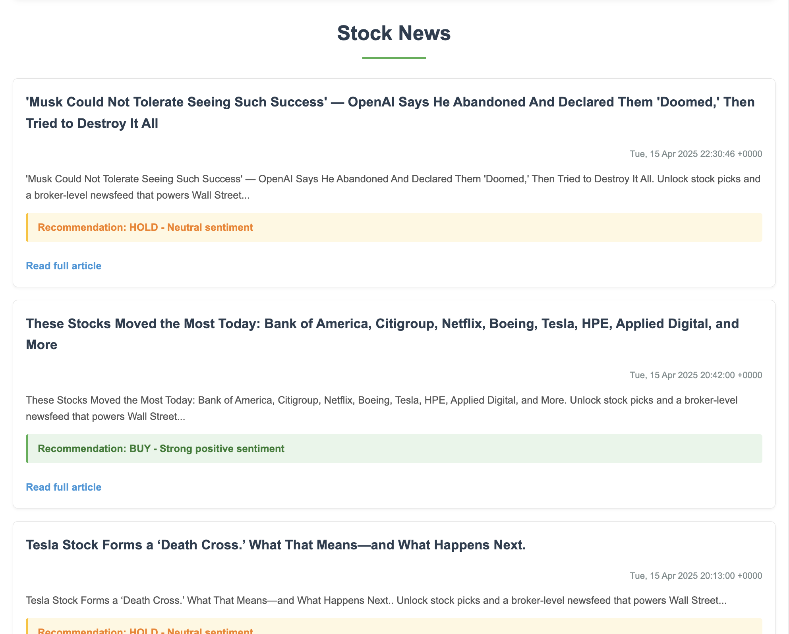

# Stock News Analyzer 📈📰


[](https://opensource.org/licenses/MIT)

A web application that analyzes stock market news sentiment and displays real-time stock data with interactive visualizations.
  
- ## 🚀 Features

- 🔎 Search for stock news by ticker symbol (e.g., `TSLA`, `AAPL`)
- 📰 Fetches latest financial news from Yahoo Finance RSS feeds
- 🧠 Uses NLP and keyword analysis to generate investment recommendations
- 📊 Displays dynamic stock price and volume charts with Chart.js
- 🥧 Visualizes sentiment breakdown using Matplotlib pie chart
- ⚡ Built with Flask, BeautifulSoup, TextBlob, and yFinance






## 🛠 Tech Stack

**Backend**:
- Python
- Flask
- Feedparser
- BeautifulSoup
- TextBlob
- yFinance
- Matplotlib

**Frontend**:
- HTML/CSS
- JavaScript
- Chart.js
- Font Awesome

## 📂 Project Structure

```
├── main.py               # Flask app logic and backend processing
├── templates/
│   └── index.html        # Main web interface
├── static/
│   └── styles.css        # Custom styling for the app
├── requirements.txt      # Python dependencies (recommended to create)
└── README.md             # This file
```

## Installation 🛠️

### Prerequisites
- Python 3.8+
- pip package manager
- 

## 🔧 How to Run Locally

1. **Clone the repo**  
   ```bash
   git clone https://github.com/your-username/stock-news-analyzer.git
   cd stock-news-analyzer
   ```

2. **Create virtual environment**  
   ```bash
   python -m venv venv
   source venv/bin/activate  # On Windows: venv\Scripts\activate
   ```

3. **Install dependencies**  
   *(Create a `requirements.txt` if not already there)*  
   ```bash
   pip install -r requirements.txt
   ```

4. **Run the app**  
   ```bash
   python main.py
   ```

5. **Open in browser**  
   Visit [http://localhost:5000](http://localhost:5000)

## 📸 Demo Preview

- Input a stock symbol and get:
  - Current market data
  - Historical stock performance
  - News articles with summaries
  - A recommendation per article
  - A sentiment pie chart

## 📌 Future Improvements

- Add user authentication
- Store and track user watchlists
- Add more news sources (Google Finance, CNBC)
- Enhance summarization using GPT API or Hugging Face models

## 📜 License

This project is for educational and non-commercial use.
